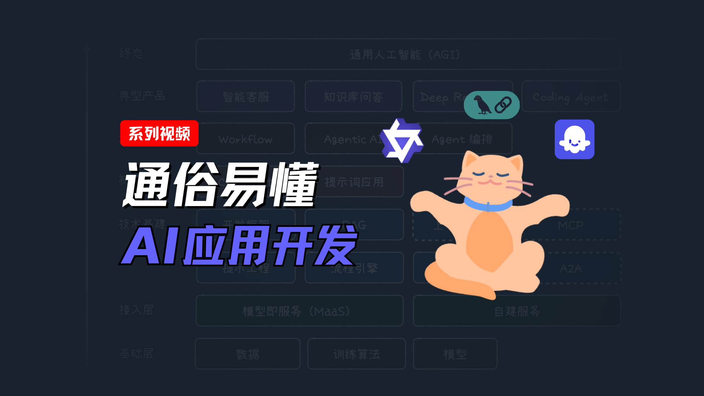

# ai-app-examples

人工智能应用开发案例库，用于学习交流。

> 此代码库是 Bilibili UP 主「捣鼓键盘的小麦」的「通俗易懂 AI 应用开发」系列视频的开源代码库。

配合视频讲解学习效果更佳：https://space.bilibili.com/3349949/lists/6061232

制作分享不易，如果可以，请给视频点赞、投币，加关注，谢谢 🙏。



# 目录说明

每个目录单独存放一个完整的可运行项目，请阅读每个目录下的 `README.md` 文件，了解项目介绍和运行方法。

- [01-chatbot-cli](./01-chatbot-cli)：一个基于命令行界面的最简聊天机器人。
- [02-chatbot-cli-stream](./02-chatbot-cli-stream)：上面机器人的流式输出改进版本。
- [03-chatbot-cli-langchain](./03-chatbot-cli-langchain)：引入 LangChain 框架的重构版本。
- [04-chatbot-ui](./04-chatbot-ui)：带 Web UI 界面的版本，含服务端（Express）和前端（React/Vite）的 SSE GET/POST 实现。
- [05-chatbot-ui-websearch](./05-chatbot-ui-websearch)：添加联网搜索功能（Workflow 范式）。

<!-- - [06-chatbot-ui-agent](./06-chatbot-ui-agent)：使用 Agentic + ReAct 范式实现联网搜索（WIP）。
- [07-chatbot-ui-langgraph](./07-chatbot-ui-langgraph)：引入 LangGraph 框架的重构版本（WIP）。
- [08-coding-agent](./08-coding-agent)：自动写简单前端项目（HTML/CSS/JS）的编程工具（LangGraph + ReAct）（WIP）。 -->

# 环境准备

此代码库包含前后端案例，为了避免引入复杂的环境配置，统一采用前端技术栈。

你需要准备好以下环境：

- Node.js >= v22.x
- 建议使用 Linux/macOS 系统，使用 Windows 的同学如果遇到问题请提交 issue。

然后，在根目录下执行以下命令，安装公共依赖包：

```bash
npm install
```

# 模型服务和 API Key 说明

为了便于国内学习者运行项目，所有案例均使用国内大模型服务接口，请先取得各项目 `README.md` 中要求的 API Key。

> 模型服务商会为新用户提供免费 Token 额度，足以支持学习使用。

请参考下面的文档获取 API Key：

- 通义千问（阿里云百炼模型服务）：https://bailian.console.aliyun.com/?tab=api#/api/?type=model&url=2712195

# 遇到问题？

在 issue 区提问求助：https://github.com/micooz/ai-app-examples/issues
